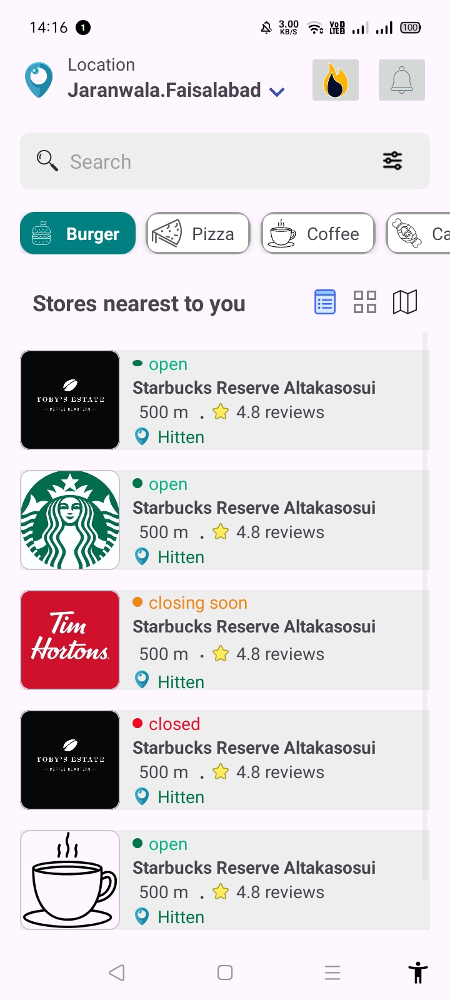

# android-material-store-layouts
# Store Discovery Android UI 📱

A modern, responsive Android interface designed for local store discovery. This project showcases two distinct architectural approaches to displaying business data: a detailed **List View** and a compact **Grid View**.

## 🌟 Overview
This project was developed to explore high-fidelity UI design using Android XML and Material Design components. The interface is localized for **Faisalabad** and focuses on providing clear, actionable information to users at a glance.

---

## 📱 Visuals

### List View Layout
*Optimized for brand recognition and detailed store information.*

### Grid View Demo
*Designed for a visual-first, compact browsing experience.*

[▶️ Click here to watch the Grid Layout Demo Video](layout_design_v.mp4)

---

## ✨ Key Features
* **Dual Layout Support:** Toggle between List and Grid view architectures.
* **Dynamic Status Indicators:** Visual badges for "Open," "Closed," and "Closing Soon" states.
* **Material Design Components:** Implementation of Google's Material Design, including:
    * **Search Bar:** Custom styling with filter options.
    * **Chips:** Interactive category selection (Burger, Pizza, Coffee).
    * **Cards:** Elevation and corner radius for a modern feel.
* **Localized UI:** Pre-configured for Jaranwala, Faisalabad.

---

## 🧠 The Technical Challenge
The core challenge of this project was managing **Visual Scannability**. 

To solve this, I implemented a logic-driven status system:
1. **Color-Coded Badges:** Using a green-to-red spectrum to indicate availability without requiring the user to read fine print.
2. **Hierarchy of Information:** Ensuring that distance (500m) and ratings (4.8 stars) were placed strategically for quick decision-making.
3. **Adaptive Icons:** Ensuring consistent icon scaling across both List and Grid views to maintain brand integrity.

---

## 🛠️ Tools & Technologies
* **IDE:** [Android Studio](https://developer.android.com/studio)
* **Language:** Kotlin / Java
* **UI Framework:** XML (Layouts, Drawables, and Styles)
* **Design System:** [Material Design 3](https://m3.material.io/)

---

## 📂 Project Structure
* `res/layout/`: Contains the XML files for both List and Grid items.
* `res/drawable/`: Custom shapes and icons for status indicators.
* `res/values/`: Color palettes and localized string resources.

---

### 👤 Contact & Connect
**Amna Jabbar**
* [LinkedIn Profile](www.linkedin.com/in/amna-jabbar)
* Virtual University (VU) - Faisalabad Campus

---
*If you find this UI helpful, feel free to ⭐ the repository!*
